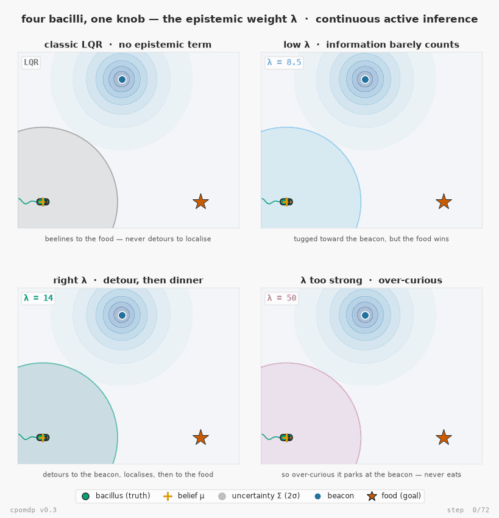

# cpomdp

Continuous active inference for Python. The continuous-state sibling of [pymdp](https://github.com/infer-actively/pymdp).

pymdp is great, but it speaks in discrete states. A lot of the world isn't discrete. Positions, velocities, temperatures, the kinds of things you'd actually want an agent to track and steer, don't come in neat little categories. cpomdp fills that gap. You hand it a linear-Gaussian model of how the world moves and what you can see of it, and you get back an agent that perceives and acts in the same `infer_states` / `sample_action` loop pymdp users already know.

That's the whole idea: keep the pymdp muscle memory, swap the discrete machinery underneath for continuous.

Full documentation — API reference and guides — lives at [inferogenesis.github.io/cpomdp](https://inferogenesis.github.io/cpomdp/).

## Example

Four bacilli seeking food in the same world — the continuous-state answer to pymdp's mouse-seeking-cheese, now with the **epistemic** term v0.3 adds. Each body sits at its **true** hidden state; the orange `+` is where it *believes* it is (`belief.mean`); the ellipse is its uncertainty (`belief.cov`); the star is the food (the goal). A **beacon** marks where the sensor is sharp, so visiting it collapses the agent's uncertainty. The four differ in **one number only** — the weight λ on the information-seeking term of the Expected Free Energy each minimises (`G = pragmatic − λ·epistemic`): with no epistemic term, **classic LQR** beelines to the food; **too little λ** barely deflects; the **right λ** detours to the beacon to localise, *then* heads to the food; **too much λ** and it never leaves the beacon. One knob, four behaviours.



Reproduce it with [`examples/bacillus_seeking_food.py`](examples/bacillus_seeking_food.py) (`pip install "cpomdp[examples]"`). More — including the original v0.2 single-bacillus demo — in the [examples gallery](examples/README.md).

## Install

```bash
pip install cpomdp
```

Or the latest from source:

```bash
pip install git+https://github.com/inferogenesis/cpomdp
```

That's all you need for normal use. There's also an optional RxInfer (Julia) backend that the test suite leans on as a correctness oracle. You almost certainly don't need it, but if you want it:

```bash
pip install "cpomdp[rxinfer]"
```

It pulls in a Julia bridge and bootstraps itself the first time you use it.

## Quickstart

Here's an agent steering a point mass to a target. It can push the mass and it can see where the mass is, but it never sees the velocity. The filter has to work that out from how the position moves.

```python
import jax.numpy as jnp
from cpomdp import Agent, Belief, LinearGaussianModel

# State is [position, velocity]. A push changes velocity, velocity carries
# position along, and we only ever observe position (through a noisy sensor).
dt = 0.1
model = LinearGaussianModel(
    dynamics=[[1, dt], [0, 1]],          # velocity carries position along
    control=[[0], [dt]],                 # a push nudges velocity
    sensor_model=[[1, 0]],               # we observe position only
    dynamics_noise=jnp.eye(2) * 1e-6,
    sensor_noise=[[1e-2]],
    prior=Belief(mean=[0, 0], cov=jnp.eye(2)),
)

# Tell it where to go: sit still at position 1.
agent = Agent(model, goal=[1.0, 0.0])

true_state = jnp.array([0.0, 0.0])
for _ in range(100):
    obs = model.sensor_model @ true_state            # what the agent gets to see
    agent.infer_states(obs)                           # perceive
    action = agent.sample_action()                    # act
    true_state = model.dynamics @ true_state + model.control @ action

print(jnp.round(agent.belief.mean, 3))   # ≈ [1, 0]
```

Run that and the belief lands on `[1, 0]`. The agent worked out it was at position 1 and sitting still, which is exactly where we asked it to go, and it did it without ever seeing the velocity it had to control.

## The pymdp parallel

If you've used pymdp, this table is basically the whole API:

| pymdp (discrete) | cpomdp (continuous)         | what it is                       |
| ---------------- | --------------------------- | -------------------------------- |
| `Agent`          | `Agent`                     | the stateful thing you drive     |
| `qs`             | `belief`                    | the posterior over the state     |
| `infer_states`   | `infer_states`              | fold in an observation           |
| `sample_action`  | `sample_action`             | pick an action                   |
| `C`              | `goal` + `goal_precision`   | the state you prefer, how sharply |
| `D`              | `model.prior`               | belief before you've seen anything |

One honest difference. `sample_action` here is deterministic, not a sample from a policy posterior. For a linear-Gaussian sensor the action that minimises expected free energy turns out to be exactly the LQR optimum, so there's a single best action and that's what comes back. Same loop, exact answer. The reasoning is in [DECISIONS.md](https://github.com/inferogenesis/cpomdp/blob/main/DECISIONS.md) (ADR-003) if you want it.

## Just want to track, not act?

Leave the goal out and you get a pure tracker. `infer_states` still folds in observations and sharpens the belief, but `sample_action` will stop you, because there's nothing to steer toward.

```python
agent = Agent(model)                  # no goal
belief = agent.infer_states([0.5])    # perceiving is fine
agent.sample_action()                 # ValueError: this Agent has no goal
```

## What's in the box

Right now (v0.1) cpomdp handles linear-Gaussian models: Kalman filtering for perception, steady-state LQR for action. That already covers a fair bit of ground, roughly anything you'd reach for a Kalman filter to do, but it's the foundation rather than the finished house. Nonlinear models and proper epistemic (information-seeking) action are the obvious next steps.

You can swap the inference engine if you want to. `KalmanBackend` is the default and does the real work; `RxInferBackend` re-derives the same answers through Julia and exists mainly so the fast path has something independent to check itself against. Both sit behind the `InferenceBackend` protocol, so you can write your own.

This is pre-alpha. The API works and the maths is tested against that independent oracle, but expect things to move before 1.0.
