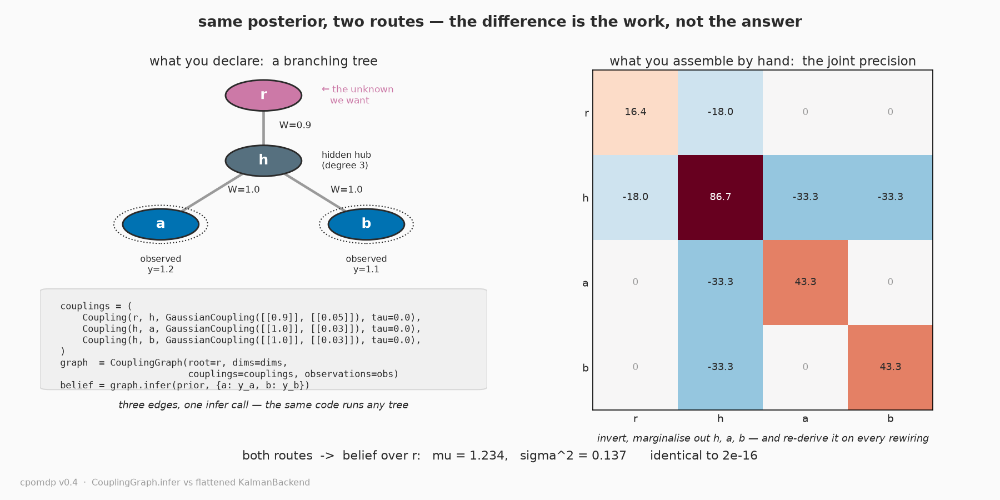

# Examples gallery

Runnable scripts that render these figures live in
[`examples/`](https://github.com/inferogenesis/cpomdp/tree/main/examples). They are
**not** part of the installed package (only `cpomdp` itself ships in the wheel) — they
import plotting libraries the core does not depend on. Get those with the `examples`
extra:

```bash
pip install "cpomdp[examples]"        # then: python examples/<script>.py
```

…or, from a source checkout, with uv: `uv run --extra examples python examples/<script>.py`.

## Flagship — instrumental epistemics: the beacon resolves food location

[`bacillus_uncertain_food.py`](https://github.com/inferogenesis/cpomdp/blob/main/examples/bacillus_uncertain_food.py) · v0.4 · ADR-013

Four bacilli in one world, differing in a single number — the **goal precision Λ** —
all minimising the same Expected Free Energy `G = pragmatic − epistemic`. The twist over
the v0.3 original (now in "the journey" below): the food's position is an explicit
**latent** the agent does not know a priori, and the beacon resolves *that* rather than
the agent's own position. So the information the beacon buys is **instrumental** — it
changes where the agent then heads — the decision-relevant epistemic value of the
discrete T-Maze task (Friston et al. 2015), which the v0.3 self-revealing beacon lacked.
The rewiring is one sensor channel; the beacon mechanic is untouched.

Classic LQR and a sharp Λ both beeline to the current food estimate and settle soonest
(step 18 of 90); a balanced Λ detours to the beacon, learns where the food really is,
*then* heads there; a weak Λ over-curiously parks at the beacon and never eats. The
detour is not free and not fastest — balanced arrives last of the regimes that arrive
(step 41) and travels farthest — but it buys precision: its final belief about the food
is ≈7x tighter than the beeliners'. Each panel's `t=` counter and border turn green and
freeze the moment that regime settles, so the GIF shows *when* each arrives, not just
whether.

The simulation is checked, not just rendered: `--scan` runs every filter through **both**
the native `KalmanBackend` and the v0.4 FFG `ChainBackend` and asserts they agree to
`atol=1e-7`.


## FFG — declare the structure, skip the joint

[`coupling_graph_figure.py`](https://github.com/inferogenesis/cpomdp/blob/main/examples/coupling_graph_figure.py) · v0.4 · ADR-012, ADR-014

A chain is the one shape a Kalman filter already is, so a chain backend proves nothing
the normal path can't — the factor graph earns its keep the moment the model *branches*.
This is the smallest model that genuinely does: a hidden root `r` feeds a hidden hub `h`
that fans out to two observed leaves `a` and `b`, giving `h` three neighbours, a degree
no path (and so no chain) can hold. The figure sets the two routes to the root's
posterior side by side: on the left, `CouplingGraph` — name the three edges, call
`infer` once; on the right, the 4x4 joint precision a normal backend makes you assemble,
invert, and marginalise back down to `r`, re-derived whenever the wiring changes. Both
land on the same belief over `r` (μ ≈ 1.234, σ² ≈ 0.137), agreeing to floating-point
noise (the figure computes the gap live and prints it). The payoff is not a different
answer — it is that the branching stays *declared* instead of flattened, the difference
ADR-014 asks the v0.4 capstone to show.



## The journey

### Four bacilli, one knob — the v0.3 original (beacon reveals YOUR position)

[`bacillus_seeking_food.py`](https://github.com/inferogenesis/cpomdp/blob/main/examples/bacillus_seeking_food.py) · v0.3

The flagship's predecessor: same four-regime shape, but the beacon collapses uncertainty
about the agent's *own* position rather than the food's — illustrative, but the simpler,
non-instrumental form of epistemic value the flagship's ADR-013 critique is about. The
simulation is real — every agent shares one Kalman filter over a `CallableSensor` whose
`R(x)` dips at the beacon, and the EFE agents call the library's own
`expected_free_energy` kernel.


### Bacillus seeking food — the original (pure LQR)

[`bacillus_lqr.py`](https://github.com/inferogenesis/cpomdp/blob/main/examples/bacillus_lqr.py)

Where it started (v0.2): a *single* bacillus with a fixed sensor, so the epistemic term
collapses to nothing (ADR-003) and active inference reduces to LQR — it perceives, acts,
and arrives. The flagship above is its v0.3 successor, switching the epistemic term back
on with a state-dependent sensor.


### EFE epistemic collapse, and how a state-dependent sensor breaks it

[`efe_collapse_figure.py`](https://github.com/inferogenesis/cpomdp/blob/main/examples/efe_collapse_figure.py)

Sweeps a one-step action and plots `G = pragmatic − epistemic` for a fixed sensor
(epistemic dead-flat → EFE collapses to LQR) versus a state-dependent sensor (a precision
well makes the epistemic term curve, pulling the argmin off the goal toward information).


### Internal process noise breaks the collapse from the inside

[`internal_noise_figure.py`](https://github.com/inferogenesis/cpomdp/blob/main/examples/internal_noise_figure.py)

The companion: the sensor noise `R` is held fixed and the action-dependence of the
epistemic term comes entirely from state-dependent **process** noise `Q(x)` — the
internal-precision route of RFC-001 §8.


