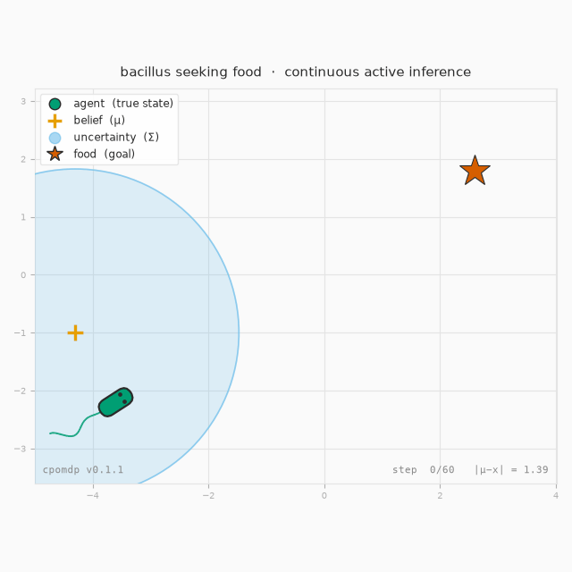

# Examples gallery

Runnable scripts that render these figures live in
[`examples/`](https://github.com/inferogenesis/cpomdp/tree/main/examples). They are
**not** part of the installed package (only `cpomdp` itself ships in the wheel) — they
import plotting libraries the core does not depend on. Get those with the `examples`
extra:

```bash
pip install "cpomdp[examples]"        # then: python examples/<script>.py
```

…or, from a source checkout, with uv: `uv run --extra examples python examples/<script>.py`.

## Flagship — four bacilli, one knob (the epistemic weight λ)

[`bacillus_seeking_food.py`](https://github.com/inferogenesis/cpomdp/blob/main/examples/bacillus_seeking_food.py)

Four bacilli in one world, differing in a single number: the weight **λ** on the
*information-seeking* term of the Expected Free Energy each minimises
(`G = pragmatic − λ·epistemic`). A **beacon** marks where the sensor is sharp, so
visiting it collapses the agent's uncertainty. Classic LQR beelines to the food; too
little λ barely deflects; the right λ detours to the beacon to localise *then* heads to
the food; too much λ and it never leaves. The simulation is real — every agent shares
one Kalman filter over a `CallableSensor` whose `R(x)` dips at the beacon, and the EFE
agents call the library's own `expected_free_energy` kernel.


## The journey

### Bacillus seeking food — the original (pure LQR)

[`bacillus_lqr.py`](https://github.com/inferogenesis/cpomdp/blob/main/examples/bacillus_lqr.py)

Where it started (v0.2): a *single* bacillus with a fixed sensor, so the epistemic term
collapses to nothing (ADR-003) and active inference reduces to LQR — it perceives, acts,
and arrives. The flagship above is its v0.3 successor, switching the epistemic term back
on with a state-dependent sensor.



### EFE epistemic collapse, and how a state-dependent sensor breaks it

[`efe_collapse_figure.py`](https://github.com/inferogenesis/cpomdp/blob/main/examples/efe_collapse_figure.py)

Sweeps a one-step action and plots `G = pragmatic − epistemic` for a fixed sensor
(epistemic dead-flat → EFE collapses to LQR) versus a state-dependent sensor (a precision
well makes the epistemic term curve, pulling the argmin off the goal toward information).


### Internal process noise breaks the collapse from the inside

[`internal_noise_figure.py`](https://github.com/inferogenesis/cpomdp/blob/main/examples/internal_noise_figure.py)

The companion: the sensor noise `R` is held fixed and the action-dependence of the
epistemic term comes entirely from state-dependent **process** noise `Q(x)` — the
internal-precision route of RFC-001 §8.


