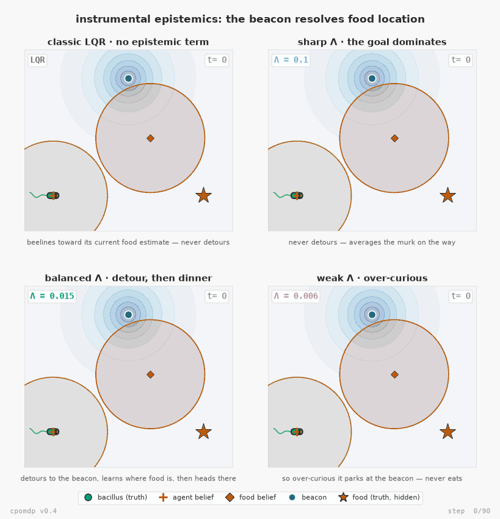

# Examples gallery

Runnable scripts that render the figures in the docs and README. They are **not**
part of the installed package (only `src/cpomdp` ships in the wheel) — they import
plotting libraries the core does not depend on.

Get the plotting deps with the `examples` extra:

```bash
pip install "cpomdp[examples]"        # then: python examples/<script>.py
```

…or, from a source checkout, with uv (no install needed):

```bash
uv run --extra examples python examples/<script>.py
```

Each script writes its asset into [`../docs/assets/`](../docs/assets) and takes an
optional output path as `argv[1]`.

---

## Flagship — instrumental epistemics: the beacon resolves food location

[`bacillus_uncertain_food.py`](bacillus_uncertain_food.py) · v0.4 · ADR-013

Expected Free Energy decomposes into an **epistemic** (information-seeking) value and
a **pragmatic**/**instrumental** (goal-seeking) value. Epistemic value is genuinely
*instrumental* — not merely curious — when the uncertainty it resolves is
decision-relevant: the discrete T-Maze task (Friston et al. 2015, "Active inference
and epistemic value") is the canonical case, where visiting a cue resolves which arm
holds the reward, changing the *subsequent* action. The v0.3 demo below ties the
beacon's epistemic value to the agent's *own* position — salience without an
instrumental payoff, since knowing your own position more precisely doesn't change
which action is later correct. This flagship promotes the food's position to an
explicit latent the agent does not know a priori, and rewires the beacon to resolve
*that* instead — now the resolved uncertainty changes where the agent then heads, the
property the v0.3 demo's epistemic value lacked. The whole change is one rewiring, the
beacon mechanic itself untouched:

```python
# v0.3: the channel reads the agent's OWN position, and the noise it carries is
# keyed on that SAME position — self-revealing.
sensor_model = I                      # C: o = agent_xy
noise_fn(x, p) = beacon_noise(x, p)   # R(x): keyed on the channel's own block

# v0.4: the channel reads a DIFFERENT block (food − agent), but the noise is
# keyed on the SAME agent-position block as before.
sensor_model = [-I, I]                   # C: o = food_xy − agent_xy
noise_fn(x, p) = beacon_noise(x[:2], p)  # R(x): still keyed on agent_xy only
```

Same four-regime structure as the v0.3 demo, same single real knob (the goal precision
Λ): classic LQR beelines toward its current (weak) food estimate and never detours; a
sharp Λ barely deflects; a balanced Λ detours to the beacon, learns where food really
is, *then* heads there with confidence; a weak Λ is so over-curious it parks at the
beacon and never eats. Each panel carries its own `t=` step counter and border, which
turn green and freeze the moment that regime first settles near the food, so the GIF
shows directly *when* each one gets there, not just whether.

That border cue is also what makes the detour's actual cost legible: the balanced
regime is **not** the fastest. Sharp (Λ=0.1) settles soonest (step 18 of 90) on the
shortest detouring path (≈9.8 units travelled); balanced (Λ=0.015) is the slowest of
the regimes that arrive at all (step 41) and travels the farthest (≈13.8 units),
*because* it deliberately detours. What that detour buys is precision, not speed: once
settled, balanced's belief about the food's location is roughly 7x tighter than sharp's
or classic LQR's (final covariance trace ≈0.004 vs ≈0.029) and its final position error
is four to five times smaller (≈0.04 vs ≈0.15-0.18). It is an explore/exploit
trade — time and distance traded for confidence — not a regime that wins on every axis.

The simulation is checked, not just rendered: every agent's filter is run through
**both inference backends**, and `--scan` checks the native `KalmanBackend` and the
v0.4 FFG `ChainBackend` agree to `atol=1e-7`.



`bacillus_uncertain_food.py --scan` prints the regime metrics and the
Kalman-vs-ChainBackend agreement check without rendering.

---

## The journey

### Four bacilli, one knob — the v0.3 original (beacon reveals YOUR position)

[`bacillus_seeking_food.py`](bacillus_seeking_food.py) · v0.3

The flagship's predecessor: same four-regime shape, but the beacon collapses
uncertainty about the agent's *own* position rather than the food's — illustrative,
but the simpler, non-instrumental form of epistemic value the flagship's ADR-013
critique is about. The simulation is real — every agent shares one Kalman filter over
a `CallableSensor` whose `R(x)` dips at the beacon, and the EFE agents call the
library's own `expected_free_energy` kernel.


`bacillus_seeking_food.py --scan` prints the precision-Λ sweep metrics without rendering.

### Bacillus seeking food — the original (pure LQR)

[`bacillus_lqr.py`](bacillus_lqr.py) · v0.2

Where it started: a *single* bacillus with a fixed sensor. Here the epistemic term
collapses to nothing (ADR-003) and active inference reduces to LQR — it simply
perceives, acts, and arrives. The v0.3 demo above is its successor, switching the
epistemic term back on with a state-dependent sensor.


### EFE epistemic collapse, and how a state-dependent sensor breaks it

[`efe_collapse_figure.py`](efe_collapse_figure.py)

Sweeps a one-step action and plots `G = pragmatic − epistemic` for a fixed sensor
(epistemic dead-flat → EFE collapses to LQR) versus a state-dependent sensor (a
precision well makes the epistemic term curve, pulling the argmin off the goal
toward the information). The "why v0.3 exists" figure.


### Internal process noise breaks the collapse from the inside

[`internal_noise_figure.py`](internal_noise_figure.py)

The companion: here the sensor noise `R` is held fixed and the action-dependence of
the epistemic term comes entirely from state-dependent **process** noise `Q(x)` —
the internal-precision route of RFC-001 §8.


